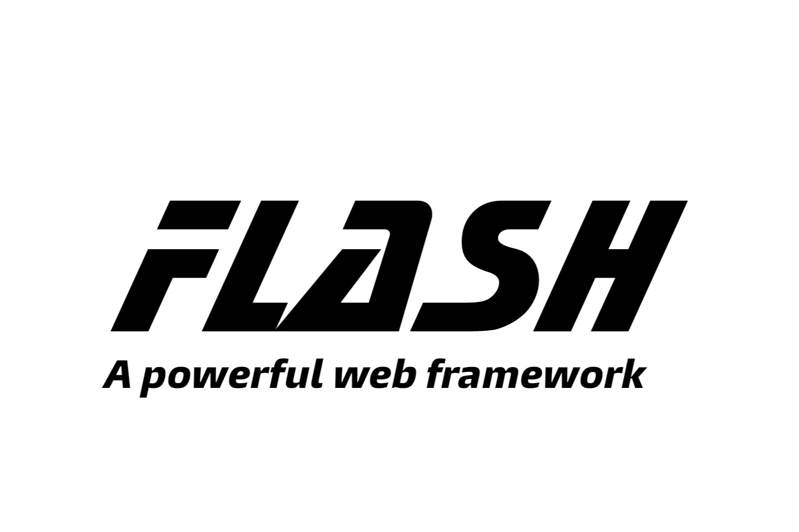

# Flash Framework

<p align="center">
  
</p>

Flash is a high performance, open source web application framework.
Flash web framework follows the MVT (Model-View-Template) architectural pattern or you can say MVC (Model-View-Controller) pattern, because controller is handle by the system.
Flash is fast, lightweight, powerful, simple and easy to use.

Flash allows user to create web applications in easy and simplest way, in Flash framework user can create their own services and library.


## Features

  - Flash is fast and powerfull web framework.
  - It is simple and easy to learn.
  - It support custom libraries and services.
  - It is based on MVT Arhitecture.
  - Easy to create API Services.
  - Easy to deploy.


## Installation

  Flash web framework is for PHP, so it's requires PHP 5.6 or newer. now you won’t need to setup anything just yet.

### Flash can be installed in few steps:

  - [Download](https://github.com/rajkumardusad/flash/archive/master.zip) the Flash files.
  - Unzip the package.
  - Upload all the Flash folders and files (system, application, .htaccess, index.php) on the server.

  That's it, in the Flash web framework there is nothing to configure and setup. it's always ready to go.


## Simple Example

  A simple `Hello, World` web application in Flash web framework.

### Create View

  Let’s write the first view. Open the `app/views.php` file and put the following PHP code in it:

```php
class view extends Views {
  function hello_world() {
    return $this->response("hello, world !!");
  }
}
```

  Hello world view is created now map this view with URLs.

### Map URLs with Views

  Let's create URL and map with views. open `app/urls.php` file and put the following code in it:

```php
//include views to route URLs
require_once("views.php");

$urlpatterns=[
  '/' => 'view.hello_world',
];
```
  Now a simple hello world web app is created.


## Documentation

  - [Learn more from Flash Documentation](docs/README.md)


## License

  [MIT License](LICENSE)
