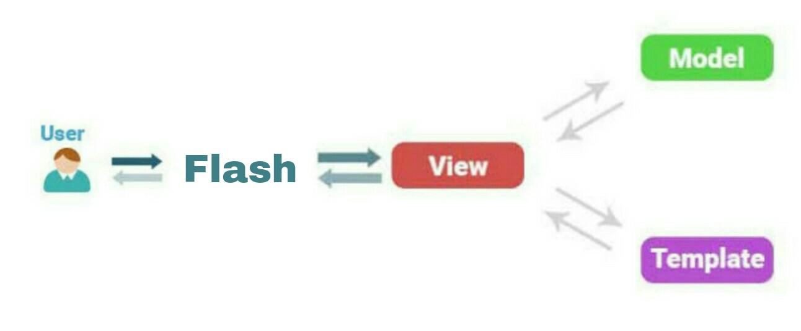

# Flash Framework

<p align="center">
  
</p>

Flash is a high performance, open source web application framework.
Flash web framework follows the MVT (Model-View-Template) architectural pattern or you can say MVC (Model-View-Controller) pattern, because controller is handle by the system.
Flash is fast, lightweight, powerful, simple and easy to use.

Flash allows user to create web applications in easy and simplest way, in Flash framework user can create their own services and library.

## Features

  - Flash is fast and powerfull web framework.
  - It is simple and easy to learn.
  - It support custom libraries and services.
  - It is based on MVT Arhitecture.
  - Easy to create API Services.
  - Easy to deploy.

## User Guide

- [Introduction](#Introduction)
  - [What is flash framework](#What-is-flash-framework)
  - [why flash framework](#why-flash-framework)
  - [Flash architecture](#Flash-architecture)
  - [Directory Structure](#Directory-Structure-of-Flash)
- [Installation](#Installation)
- [Views](#Views)
  - [Create Views](#Create-a-view)
  - [Render templates](#Render-templates)
  - [Response data](#Response-data)
  - [Use Models](#Use-Models)
- [URLs](#URLs)
  - [Map Urls with Views](#Map-Urls-with-Views)
  - [URL patterns and slug](#URL-patterns-and-slug)
  - [Regular Expressions](#Regular-Expressions)
- [Models](#Models)
  - [Create Models](#Create-a-model)
  - [Use Database](#Use-Database)
- [Templates](#Templates)
- [Static and Media files](#Static-and-Media-files)
- [Session](#Session)
- [Cookie](#Cookie)
- [Request Data](#Request-Data)
  - [GET Data](#GET-Data)
  - [POST Data](#POST-Data)
- [Libraries and Services](#Libraries-and-Services)
  - [What is Libraries and Services](#What-is-Libraries-and-Services)
  - [Create Libraries](#Create-Libraries)
  - [Create Services](#Create-Services)
- [System Libraries](#System-Libraries)
  - [Request](#Request)
  - [Security](#Security)
- [Databases](#Database)
  - [Connect Database](#Connect-Database)
  - [Database Query](#Database-Query)
- [Security](#Security)
  - [SQL Injection](#SQL-Injection)
  - [XSS](#XSS)
  - [CSRF](#CSRF)
- [ErrorHandler](#ErrorHandler)
- [Settings](#Settings)
- [How to Deploy](#How-to-Deploy)


## Introduction

### What is flash framework

Flash is a high performance, open source web application framework.
Flash web framework follows the MVT (Model-View-Template) architectural pattern or you can say MVC (Model-View-Controller) pattern, because controller is handle by the system.
Flash is fast and lightweight web framework.

Flash allows user to create web applications in easy and simplest way, in Flash framework user can create their own services and library.

### why flash framework

Flash is fast and lightweight php web framework. Flash framework is very simple and easy to learn. even if you are new in web development don't worry you will love this framework.

  - Flash is fast and powerfull web framework.
  - It is simple and easy to learn.
  - It support custom libraries and services.
  - It is based on MVT Arhitecture.
  - Easy to create API Services.
  - Easy to deploy.

### Flash architecture

<p align="center">
  
</p>

Flash web framework based on MVT (Model-View-Template) architecture. The MVT (Model-View-Template) is a software design pattern. The Model helps to handle database. It is a data access layer which handles the database.
The Template is a presentation layer which handles User Interface part. The View is used to execute the business logic and interact with a model to carry data and renders a template.


### Directory Structure of Flash

```
/system
/application
    /app
        /templates
        /models.php
        /views.php
        /urls.php
    /app1
    /app..n
    /templates
    /settings.php
    /urls.php
/.htaccess
/index.php
```

#### system directory
  system directory is main system directory of flash framework, where all the system files are stored.

#### application directory
  application is main project directory that contains all your apps and project files. you can change this default application directory to different location, set the new APP_DIR path in index.php to change the default application directory. all your app project files (settings, urls) shold be inside the application directory.

#### app directory
  app is demo application of your project. your can create new apps like login, admin, news, blogs or any app that you want. your app directory contains views, models and urls files.

#### templates directory
  templates directory contains all your HTML template files.


## Installation

  Flash web framework is for PHP, so it's requires PHP 5.6 or newer. now you won’t need to setup anything just yet.

### Flash can be installed in few steps:

  - [Download](https://github.com/rajkumardusad/flash/archive/master.zip) the Flash files.
  - Unzip the package.
  - Upload all the Flash folders and files (system, application, .htaccess, index.php) on the server.

  That's it, in the Flash web framework there is nothing to configure and setup. it's always ready to go.


## Views
  Views are classes that render templates, communicate with models and contain all the business logic of web application.
  generally all the views are written in a views.php file that is in your application directory or apps directory, but you can create your own views file in Flash framework.

### Create a view
  Let’s write the first view. Open the `app/views.php` file and put the following PHP code in it:

```php
class view extends Views {
  function hello_world() {
    return $this->response("hello, world !!");
  }
}
```

  a simple hello world view is created, to render views map your view with URLs.


### Render templates

  Render html templates, crate a template `hello.html` or `hello.php` in templates directory.

```php
class view extends Views {
  function hello_world() {
    //Render HTML Templats
    return $this->render("hello");
  }
}
```

### Response data

  response simple string data :

```php
class view extends Views {
  function hello_world() {
    //Response string data
    return $this->response("hello");
  }
}
```

  response simple string data with response code :

```php
class view extends Views {
  function hello_world() {
    //Response string data with response code
    return $this->response("404 Page not found !!", 404);
  }
}
```

  response http response code :

```php
class view extends Views {
  function hello_world() {
    //Response http response code
    return $this->response_code(404);
  }
}
```

### Use Models

  Create a model Test and include models file in views file.

```php
//Include models file
require_once('models.php');

class view extends Views {
  function demo() {
    //Create model object
    $test = new Test();
    return $this->response($test->get_data());
  }
}
```


## URLs

  Flash allows to create simple and clean urls without any limitation. create URLs and map with views.

### Map URLs with Views

  Let's create URL and map with views. open `app/urls.php` file and put the following code in it:

```php
//include views to route URLs
require_once("views.php");
require_once("product_view.php");

$urlpatterns=[
  '/' => 'app_view.home',
  '/product/{slug}' => 'product.data',
  '/about' => 'app_view.about',
];
```

### URL Patterns and slug

  Flash framework allows to create custom urls patterns.

  Example :
```
/product/1
/product/2
/product/3
```

  here the product id is dynamic it can be change on every request.

```php
$urlpatterns = [
  '/product/{slug}' => 'view.product',
];
```

  To access slug pattern data create a function product and pass parameter. now we can access the id of product and render the product data.

```php
class view extends Controller {
  function product($id){
    return $this->response("Product : $id");
  }
}
```

  Flash does not support any int, str, float type but you can use them in slug. {slug} support all the int, float, and string as well as Wildcards.

### Regular Expressions

  Flash allows to define URLs routing rules using regular expressions. Any valid regular expression is allowed.

```php
'/product/([0-9]+)' => 'view.product',
```

  this example is similar to :

```
/product/1
/product/2
/product/3
```

### Include URls

  Include your application URls file in main URLs file.

```php
$urlpatterns=[
  '/' => urls('application/app/urls.php'),
  '/product/{slug}' => urls('application/product/urls.php'),
];
```


## Models

  Models are classes that are designed to work with database. it manages the database, logic and rules of the web application.

### Create a model

  Let’s create the first model. Open the `app/models.php` file and put the following PHP code in it:

```php
class blog extends Models {
  private $title;
  private $author;
  private $date;
  function get_data() {
    $result = $this->db->query('select * from blog');
    return $result;
  }
}
```

### Use Database

  Create database connection in settings file and access database in models.

```php
class blog extends Models {
  function get_data() {
    //select data from database
    $result = $this->blog_db->query('select * from blog');
    return $result;
  }

  function put_data($title,$author) {
    //insert data in database
    return $this->blog_db->query("insert into blog values('$title','$author')");
  }
}
```

  **Manually create database connection**

```php
class blog extends Models {
  function get_data() {
    //create database connection
    $this->connect('blog_db');
    //select data from database
    return $this->blog_db->query('select * from blog');
  }
}
```


## Templates

  The Template is a presentation layer which handles User Interface part. Flash Framework by default store all the template in templates directory, but you can change the template directory in settings. go to settings file add your template directory path in template array.

#### Create a HTML template

  Create a `hello.html` or `hello.php` file in a templates directory and put the following code in it.

```html
<!DOCTYPE>
<html>
<head>
  <title>Hello world</title>
</head>
<body>
  <h1>Hello world!!</h1>
</body>
</html>
```
 this is a simple hello world template file.

#### How to render templates

  render your templates.

```php
class view extends Views {
  function hello() {
    //render html templates
    return $this->render('hello');
  }
}
```

#### How to pass data in templates

  we can pass any data in templates using array.

```php
class view extends Views {
  function hello() {
    //data
    $blog = array(
      'title' => 'this is title',
      'author' => 'author name',
      'date' => '13-Fab-2020',
    );
    //pass data to template
    return $this->render('hello',$blog);
  }
}
```

  **Access Data in templates**

```html
<!DOCTYPE>
<html>
<head>
  <title><?php echo $title; ?></title>
</head>
<body>
  <?php echo $title; ?>
  <?php echo $author; ?>
  <?php echo $date; ?>
</body>
</html>
```

## Static and Media files

#### Static files

  Websites are need some static files, these static files are js, css, images etc. Flash Framework help us to manage these static files.

  - Set your static files directory in settings file.

```php
$setting['static'] = '/application/your_static_dir';
```

  - Use static files in templates.

```html
<!DOCTYPE>
<html>
<head>
  <title>cat image</title>
</head>
<body>
  static.'/img/cat.jpg'; ?>' alt='cat image'/>
  <!-- or -->
  uri->static('/img/cat.jpg'); ?>' alt='cat image'/>
</body>
</html>
```

  - `$this->static` variable store your static directory path.
  - `$this->uri->static()` function return full path of static directory.

#### Media files

  media directory is used to upload files like user profile image, files etc.

  - Set your media files directory in settings file.

```php
$setting['media'] = '/application/your_media_dir';
```
  - Use media files in templates.

```html
<!DOCTYPE>
<html>
<head>
  <title>cat image</title>
</head>
<body>
  media.'/img/cat.jpg'; ?>' alt='cat image'/>
  <!-- or -->
  uri->media('/img/cat.jpg'); ?>' alt='cat image'/>
</body>
</html>
```

  - `$this->media` variable store your media directory path.
  - `$this->uri->media()` function return full path of media directory.


## Session

  sessions provide a way to store information about the user across multiple requests.

  **Create a New Session**

```php
//Create new session
$this->session->set('email','example@gmail.com');
```

  **Get Session Data**

```php
//Get session data
$this->session->email;
//OR
$this->session->get('email');
```


  **Delete Session Data**

```php
//Delete a session data
$this->session->delete('email');
```

  It will delete only session variable data.


  **Delete Session**

```php
//Delete all session
$this->session->delete();
```

  It will delete all session data.


## Cookie

  cookie is a small piece of information which is stored at client browser. It is used to recognize the user. Cookie is created at server side and saved to client browser. Each time when client sends request to the server, cookie is embedded with request.

  **Create a New Cookie**

```php
//Create new cookie
$this->cookie->set('email','example@gmail.com',time()+(60*30),'/');
```

  **Get Cookie Data**

```php
//Get cookie data
$this->cookie->email;
//OR
$thie->cookie->get('email');
```

  **Delete Cookie**

```php
//Delete cookie
$this->cookie->delete('email');
```


## Request Data

  Get all HTTP Request data.

#### GET Data

```php
//GET Request Data
$this->get->var_name;
```

  Get all GET Request data.

#### POST Data

```php
//POST Request Data
$this->post->var_name;
```

  Get all POST Request data.


## Libraries and Services

#### What is Libraries and Services

  **Library**

  Libraries are classes that are located in the library directory.

  **Service**

  Services are reusable functions, classes and variables that are located in the Service directory.

#### Create Libraries

  user's can create their own libraries in Flash framework.

  - **Create your library**

  create `hello.php` in library directory and put the following php code in it.

```php
//hello world library
class hello {
  function say_hello($name) {
    echo "hello, $name";
  }
}
```

  - **Install your library**

  go to settings file add your library in `library` array.

```php
$library = [
  'application/library/hello'
];
```

  - **Use library**

```php
class view extends Views {
  function hello() {
    return $this->hello->say_hello("World");
  }
}
```

  - **Set alias name to your library**

```php
$library = [
  //set alias name
  'application/library/hello' => 'say',
];
```

```php
class view extends Views {
  function hello() {
    return $this->say->say_hello("World");
  }
}
```

  Any library and service can not be used in models.


#### Create Services

  user's can create their own services in Flash framework.

  - **Create your service**

  create `hello.php` in service directory and put the following php code in it.

```php
//hello world service
class hello {
  function say_hello($name) {
    echo "hello, $name";
  }
}
```

  - **Install your service**

  go to settings file add your service in `service` array.

```php
$service = [
  'application/service/hello'
];
```

  - **Use service**

```php
class view extends Views {
  function hello() {
    //create service object
    $hello = new hello();
    return $hello->say_hello("World");
  }
}
```

  Any library and service can not be used in models.


## System Libraries

  Flash framework provide lots of pre-defined system libraries.

  There are several libraries available in Flash framework.

  - [Request Library](#Request)
  - [Security Library](#Security)

  **Install system library**

```php
//install system library
$install = [
  'system.request',
  'system.security',
];
```

  **Use system library**

```php
class view extends Views {
  function home() {
    //check request method
    if($this->request->is_post) {
      //POST Request
    }
    return $this->render('home');
  }
}
```


## Databases

  Flash framework support fast and secure database connection.

#### Database Configuration

  Configure your databse settings in settings file.

```php
//Initialize database connection
$connect=['db'];

$db['db']= [
    'dsn' => '',
    'hostname' => 'localhost',
    'port' => '',
    'username' => 'demo_user',
    'password' => '1234',
    'database' => 'demo',
    'driver' => 'mysqli',
    'char_set' => 'utf8',
];
```

  **Database Configuration :**

  - **dsn** : The full DSN string describe a connection to the database. by default you can leav it will blank.
  - **hostname** : The hostname of your database server.
  - **port** : The port of your database server.
  - **username** : The username used to connect to the database.
  - **password** : The password used to connect to the database.
  - **database** : The name of the database you want to connect to.
  - **driver** : The name of the database driver (mysqli,pdo,sqlite3).
  - **char_set** : The character set used in communicating with the database.


#### Database Connection

  Configure your database settings and initialize database connection.

  **Initialize database connection**

```php
//Initialize database connection
$connect = [
  'db',
  'blog_db',
];
```

  Add your databse in the `connect` array to initialize database connection.

**Manually Initialize database connection**

```php
class model Models {
  function blog() {
    //initialize database
    $this->connect('db');
    $this->connect('blog_db');
  }
}
```

  Flash framework automatically create new database connection from settings.

#### Database Query

  Flash framework support very simple databse query.

```php
class blog_model extends Models {
  function get_data() {
    //select data from blog_db
    return $this->blog_db->query('select * from blog');
  }
}
```


## Request

  Resquest library handle all the HTTP Request and Server information.

  **Request Header Information**

  - `scheme` : Request scheme http or https.
  - `method` : Which request method was used to access the page; e.g. 'GET', 'HEAD', 'POST', 'PUT'.
  - `protocol` : Name and revision of the information protocol via which the page was requested e.g. 'HTTP/1.0'.
  - `host` : The HTTP Host header sent by the client.
  - `accept` : Acceptable content types for the response. 
  - `language` : Acceptable languages for the response. Example: 'en'.
  - `encoding` : Acceptable encodings for the response. Example: 'gzip'.
  - `connection` : header from the current request, if there is one. Example: 'Keep-Alive'.
  - `referer` : The address of the page (if any) which referred the user agent to the current page. This is set by the user agent. Not all user agents will set this, and some provide the ability to modify HTTP_REFERER as a feature. In short, it cannot really be trusted.
  - `content_type` : A string representing the MIME type of the request, parsed from the CONTENT_TYPE header.
  - `content_length` : The length of the request body (as a string).
  - `user_agent` : This is a string denoting the user agent being which is accessing the page. A typical example is: Mozilla/4.5 [en] (X11; U; Linux 2.2.9 i586). 
  - `headers` : Fetch all HTTP request headers.

  **Server Information**

  - `hostname` : The Host name from which the user is viewing the current page.
  - `port` : The port on the server machine being used by the web server for communication. For default setups, this will be '80'; using SSL, for instance, will change this to whatever your defined secure HTTP port is.

  **Request Information**

  - `is_secure` : TRUE if the current request is https.
  - `is_ajax` : TRUE if the current request is made by ajax.
  - `is_get` : TRUE if the current request is GET.
  - `is_post` : TRUE if the current request is POST.
  - `is_put` : TRUE if the current request is PUT.
  - `is_delete` : TRUE if the current request is DELETE.
  - `is_patch` : TRUE if the current request is PATCH.
  - `is_head` : TRUE if the current request is HEAD.
  - `is_options` : TRUE if the current request is OPTIONS.
  - `is_connect` : TRUE if the current request is CONNECT.
  - `is_trace` : TRUE if the current request is TRACE.
  - `is_copy` : TRUE if the current request is COPY.
  - `is_link` : TRUE if the current request is LINK.
  - `is_unlink` : TRUE if the current request is UNLINK.
  - `is_lock` : TRUE if the current request is LOCK.
  - `is_unlock` : TRUE if the current request is UNLOCK.
  - `is_purge` : TRUE if the current request is PURGE.
  - `is_propfind` : TRUE if the current request is PROPFIND.
  - `is_view` : TRUE if the current request is VIEW.
  - `is_http` : TRUE if the current request is http.
  - `is_https` : TRUE if the current request is https.

  **Path Information**

  - `url` : absolute URL of current request.
  - `path` : path of current request.
  - `path_info` : path of current request with query string.

  **User Information**

  - `remote_addr` : The IP address from which the user is viewing the current page.
  - `is_redirected` : True if user is redirected from somewhere.


## Security

  Security library provide basic security feature to the web application. flash framework provide CSRF, XSS and SQL Injection protection.

#### SQL Injection

  SQL Injection is a technique where an attacker creates or alters existing SQL commands to expose hidden data, or to override valuable ones, or even to execute dangerous system level commands on the database host. 

  **Avoid SQL Injection**

  - Use prepared statements.
  - Use database-specific string escape function (e.g. `mysql_real_escape_string()`, `sqlite_escape_string()`, etc.).

#### XSS

  Cross site scripting (XSS) is a common attack vector that injects malicious code into a vulnerable web application.
  Flash Framework provide XSS protection.

```php
class view extends Views {
  function blog() {
    //XSS Clean
    $data = $this->security->xss_clean($blog_data);
    return $this->response($data);
  }
}
```
  Use `$this->security->xss_clean()` to avoid xss attack.


#### CSRF

  Cross site request forgery (CSRF), also known as XSRF, Sea Surf or Session Riding attack. CSRF is a type of malicious exploit of a website where unauthorized commands are transmitted from a user that the web application trusts.

  **Add CSRF Token :**

  Add CSRF Token in your web form to avoid CSRF attack.

```html
<form method="POST">
  <?php $this->security->csrf_token(); ?>
  <input type="text" name="username" palceholder="Username">
  <input type="password" name="password" placeholder="Password">
  <input type="submit" name="submit" value="Login">
</form>
```

  **Add CSRF token in AJAX**

  Add CSRF token in Ajax request.

```javascript
$.ajax({
  type: "POST",
  url: "/login",
  data: {
    carf_token: "<?php echo $this->security->get_csrf_token(); ?>",
    username: "user_name",
    password: "password"
  },
  success: function(data){
     //success response data
  }
});
```

  **Verify CSRF Token**

```php
class view extends Views {
  function login() {
    //Form Submit
    if($this->request->is_post) {
      //Verify CSRF Token
      if($this->security->csrf_verify()) {
        //Valid CSRF Token
        $username = $this->post->username;
        $password = $this->post->password;
      } else {
        //Invalid CSRF Token
      }
    } else {
      //Render Login Page
      return $this->render('login');
    }
  }
}
```

  Add CSRF token in your web form and verify that token, to authenticate the web form and avoid CSRF attack.


## ErrorHandler

  Handle Errors like 404 (page not found), 500 (Internal Server Error), etc.

  Create you custom ErrorHandler to handle any server errors.

  **Example :**

  1. Create your ErrorHandler view.
```php
function page_not_found($request) {
  return $this->response('404 Page Not Found', 404);
}
```

  2. Include your views to urls file.
  3. Map your handler with errorhandler array.

```php
$errorhandler = [
  '404' => 'view_name.page_not_found',
];
```

  it will redirect all 404 errors to your page_not_found view.

  ***Note : The ErrorHandler array, it must be in the main urls file only.***


## Settings

  A settings file is a application default setting and configuration file.

  **Debug**

  Set the error_reporting directive at runtime.

  ***SECURITY WARNING: don't run with debug turned on in production.***

```php
$setting['debug'] = TRUE;
```
  Set `$setting["debug"] = TRUE;` to show all error's.

  Set `$setting["debug"] = FALSE` to hide all error's in production.
  
  **User Libraries Configuration**

  Install user defined libraries in you web application.

```php
$library = [
  'application/library/my_library',
];
```

  **User Services Configuration**

  Install user defined Services in you web application.

```php
$service = [
  'application/service/my_library',
];
```

  **System Apps and Libraries Configuration**

  Install system libraries in you web application.

```php
$install = [
  'system.request',
  'system.security',
];
```

  **Initialize Database Connection**

  Initialize your database connection.

```php
//Initialize database connection
$connect = [
  'db',
  'blog_db',
];
```

  Add your databse in the `connect` array to initialize database connection.

  **Database Configuration**

```php
$db['db']= [
    'dsn' => '',
    'hostname' => 'localhost',
    'port' => '',
    'username' => 'demo_user',
    'password' => '1234',
    'database' => 'demo',
    'driver' => 'mysqli',
    'char_set' => 'utf8',
];
```

  Database Configuration :

  - **dsn** : The full DSN string describe a connection to the database. by default you can leav it will blank.
  - **hostname** : The hostname of your database server.
  - **port** : The port of your database server.
  - **username** : The username used to connect to the database.
  - **password** : The password used to connect to the database.
  - **database** : The name of the database you want to connect to.
  - **driver** : The name of the database driver (mysqli,pdo,sqlite3).
  - **char_set** : The character set used in communicating with the database.


  **Static Files Configuration**

  Add your static files directory path.

```php
$setting['static'] = 'application/static';
```

  **Media Files Configuration**

  Add your media files directory path.

```php
$setting['media'] = 'application/media';
```

  **Templates Configuration**

  Add your templates directory path.

```php
$template = [
  'application/templates',
];
```

  **Urls Settings**

  Set main URLs file path

```php
$setting['urls'] = 'urls.php';
```

  Ignore trailing slashes

```php
$setting['ingore_slash'] = FALSE;
```

  Set `$setting['ignore_slash'] = TRUE` if you want to ignore trailing slashes.

  Set `$setting['ignore_slash'] = FALSE` if you don't want to ignore trailing slashes.


  **Set Default timezone**

  Set your default timezone.

```php
//Set default timezone
date_default_timezone_set('UTC');
```

## How to Deploy

  It's very easy to deploy Flash web application.

  - it's requires PHP.
  - Upload your Flash files and directory on the server.

```
 /public_html
      /application
      /system
      /.htaccess
      /index.php
```

  Now you Flash web application is ready to go.


## License

  [MIT License](LICENSE)
